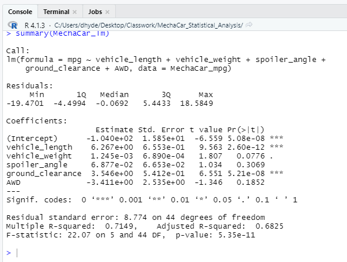
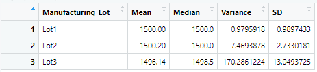
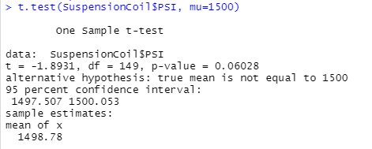
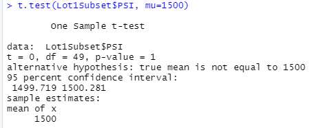
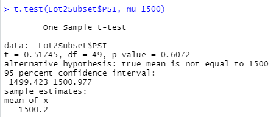
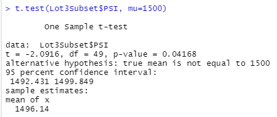

# MechaCar Statistical Analysis
## Linear Regression to Predict MPG

This multiple linear regression summary shows the relationship of several independent variables to the dependent variable "miles per galon (mpg)".  By examining the calculated p-values, it is shown that vehicle length and ground clearance both are unlikely to provide random amounts of variance to the linear model, thus they have a significant impact on the mpg of the cars. Due to the nature of multiple linear regressions, it is not possible to define a slope for the entire linear model. However, each independent variable has a slope in relation to the dependent variable, and in this model vehicle length, ground clearance, and AWD have non-zero slopes. I believe that this linear model predicts mpg of MechaCar prototypes effectively because it has a high r-value of 0.715, showing that the model explains a lot of variation in the data, and it also has a low p-value of 5.35e-11, showing that the model is significant and fits the data well. One fault of this model is that the intercept has a low p-value, showing that it explains a significant amount of variability in the dependent variable when all independent vareables are equal to zero. Some of the independent variables may need to be scaled or transformed to increase the predictive power of the model.

## Summary Statistics on Suspension Coils

The summary table of all Suspension Coil PSIs shows a mean value of 1498.7 psi and a median of 1500 psi with a variance of 62.2 psi. The similarity between the mean and median indicates there is no significant skew in data distribution. The variance of the total PSIs is under the stated cap of 100 psi variance, but when comparing the summary statistics of the three lots, it is shown that Lot 1 and Lot 2 have ideal variances of 1 psi and 7.5 psi respectively, but Lot 3 has a variance of 170 psi, well over the 100 psi cap. Therefore, while the data as a whole appears to meet the design specifications, in truth, Lot 3 fails to meet the design specifications of no more than 100 psi variance.

## T-Tests on Suspension Coils

Performing a t-test on all Suspension Coil PSIs versus the assumed population mean of 1500 psi produced a p-value of 0.06 meaning it fails to reject the null hypothesis that there is no statistical difference between the observed sample mean and the presumed population mean.

  

When the same t-test is performed on subsets of the data grouped by manufacturing lot, it is shown that both Lot 1 and Lot 2 fail to reject the null hypothesis, but Lot 3 with a p-value of 0.04168 does reject the null hypothesis, indicating there is a statistica difference between the sample mean of Lot 3 and the presumed population mean of 1500 psi.

## Sudy Design: MechaCar vs Competition
When considering the best way to compare MechaCar to its competitors from a consumer's standpoint, I believe that the metrics that are most widely considered important are cost and city fuel efficiency. The cost of a vehicle is usually dependant on the manufacturing costs and technology of the vehicle, and can often be an indicator of performance; therefor, I propose a study that would compare the city fuel efficiency of MechaCar to competition within the same price bracket. The data needed to perform this study would be the manufacturer and city fuel efficiency of all cars within the same price bracket as MechaCar. To compare MechaCar city fuel efficiency with competitors, I would perform a one-way ANOVA test where the dependent variable (city fuel efficiency) is tested across the independent variable (Manufacturer). The null hypothesis = the means of all groups are equal, and the alternate hypothesis = at least one of the means is different from all other groups. This ANOVA test would show if there are statistically significant differences in city fuel efficiency across Manufacturers, and if we reject the null hypothesis we we would be able to show which of MechaCar's competitors they outperform.
